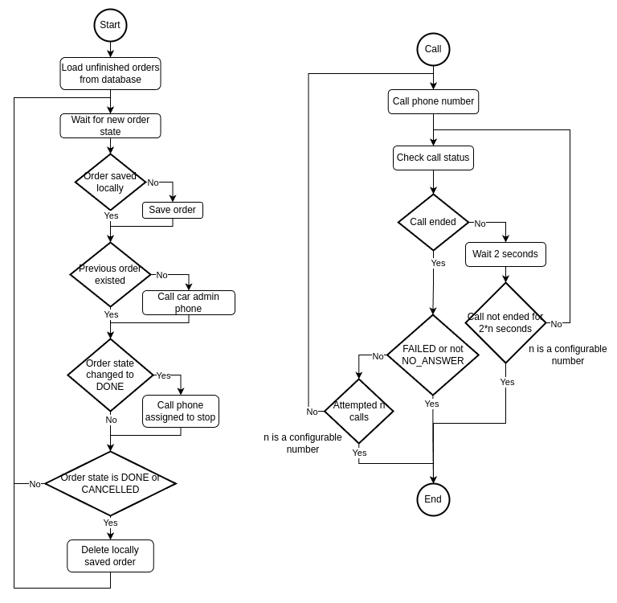

# Fleet notifications


Python script that generates notifications on state changes of Fleet Protocol devices.

This script is responsible for calling the car admin number and the number assigned to stops. Car admins are called whenever a mission is started, stop numbers are called whenever a car reaches a stop.

Order states from the [Fleet Management API](https://github.com/bringauto/fleet-management-http-api) are being checked constantly. If the received state belongs to a new order, the order gets saved locally until it is finished (this makes sure that the order continues where it left off, in case it needs to be restarted). If the newly saved order is the only one saved, the car admin phone is called. If a state has the status DONE, and the previous status was different, the phone number of the corresponding stop gets called.

The following flow chart is a simplified version of the program logic:



## Requirements
Python 3.10.12+

## Usage
To run the script execute the following from the root directory:

```bash
pip3 install -r requirements.txt
python3 -m fleet_notifications <path-to-config-file> [OPTIONS]
```
The script automatically connects to the PostgreSQL database using data from the config file. If you want to override these values, start the server with some of the following options:

|Option|Short|Description|
|------------|-----|--|
|`--username`|`-usr`|Username for the PostgreSQL database|
|`--password`|`-pwd`|Password for the PostgreSQL database|
|`--location`|`-l`  |Location of the database (e.g., `localhost`)|
|`--port`    |`-p`  |Port number (e.g., `5430`)|
|`--database-name`|`-db`|Database name|

Note that these data should comply with the requirements specified in SQLAlchemy [documentation](https://docs.sqlalchemy.org/en/20/core/engines.html#database-urls).

### Configuration
The settings can be found in the `config/config.json`, including the database information and parameters for Fleet management connection.

```json
{
    "database": {
        "server": {
            "location": "localhost",
            "port": 5432,
            "username": "postgres",
            "password": "1234",
            "database_name": "postgres"
        }
    },
    "fleet_management_server": {
        "base_uri": "https://api.dev.bringautofleet.com/v2/management",
        "api_key": ""
    },
    "twilio": {
        "account_sid": "",
        "auth_token": "",
        "from_number": "",
        "play_sound_url": "https://bringauto.com/wp-content/uploads/2021/10/BringAuto.mp3",
        "repeated_calls": 3,
        "call_status_timeout_count": 60
    },
    "car": {
        "name": "virtual_vehicle"
    }
}
```

- twilio
  - repeated_calls: how many times a phone will be called until a call is picked up
  - call_status_timeout_count: how many times a call status should be polled until calling is given up on
- car
  - name: name of car in Fleet Management API